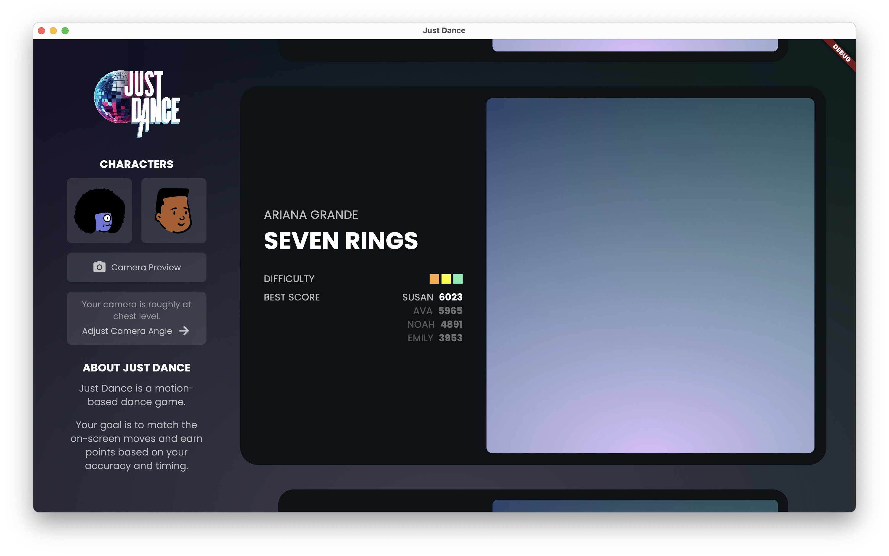
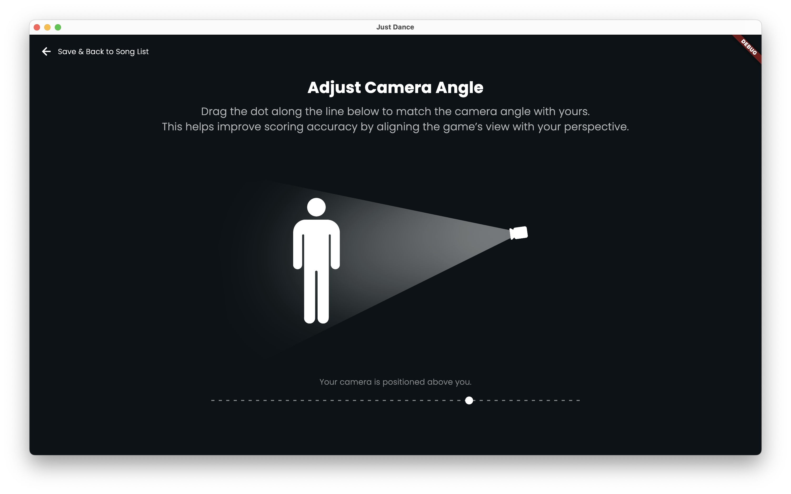
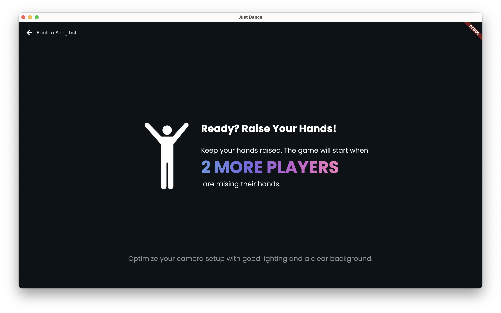
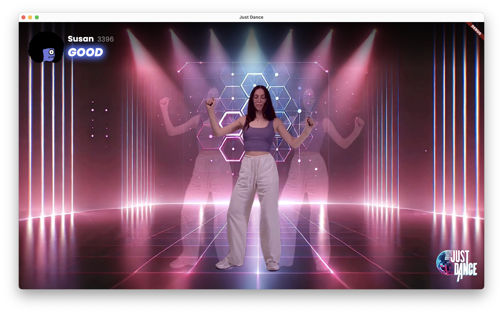

# Just Dance🪩
A machine learning-based dancing game, using human pose estimation.

## Overview
Our **Just Dance App** is an interactive dance game that leverages advanced computer vision and machine learning techniques to track and score players' dance moves in real-time. The app utilizes human pose estimation, pose comparison algorithms, and real-time player tracking to provide an engaging and accurate dance scoring experience.

This project involves two main components:
1. A **Flutter-based desktop app** that provides the front-end interface for the game.
2. A **Python-based server** that runs locally on the user's machine, and is responsible for performing the pose estimation, tracking, and scoring algorithms, communicating with the app via gRPC.

## Key Features
1. **Human Pose Estimation**: Powered by the ViTPose model, which delivers highly accurate human pose keypoints by leveraging transformer-based architecture.
2. **Pose Comparision Algorithm**: This algorithm uses an angular-based comparison method to evaluate the player's pose against a short window of poses performed by the dancer around the corresponding time. A final comparison score is then generated, which is converted into a score displayed on the app in real-time.
3. **Human Tracking**: Implements SORT (Simple Online and Realtime Tracking), optimized with custom modifications to efficiently track multiple players in dynamic scenes.
4. **Camera Angle Independece**: The player can specify the angle at which their camera is positioned. The algorithm then knows to compare their dance movements to the dancer's pose sequence that was filmed from the most similar angle.

## App Screenshots
These screenshots show the following screens: the homepage, the camera angle adjustment screen, the game initialization screen, the in-game screen, and the winner screen, respectively.

#### Platform Availability
The game is intended to be available on macOS, Windows, and Linux. However, it has only been tested on macOS at this time.

